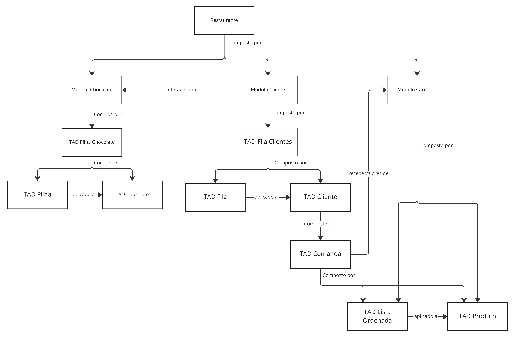

# Trabalho Prático - Estruturas de Dados 1

## Instruções para desenvolvimento do trabalho
Instruções sobre como o trabalho deve ser feito estão em [orientações.md](./doc/orientacoes.md)

## Compilação, Teste e Execução
Para fazer a compilação é necessário ter instalado os programas make e gcc, os comandos do make utilizam dos comandos linux mkdir, rm e diff

O programa final é gerado em bin/restaurante, os binários de TAD e módulos são gerados em obj/\*.o, binários de teste gerados em test/\*.test

Para compilar os arquivos do programa execute:
```shell
make
```
Para executar a aplicação
```shell
make run
```
Para rodar os casos de teste
```shell
make test
```
Para fazer a limpeza dos arquivos de compilação gerados
```shell
make clean
```
## Estrutura do programa


Arquivo fonte principal restaurante.c localizado em pasta apps

Arquivos fonte de módulos e TAD´s localizados em pasta src

Arquivos de cabeçalho localizados em pasta include

## Etapas de desenvolvimento
### Criação de TAD´s
* Criar TAD Lista Ordenada, com lista encadeada
* Criar TAD Pilha, com lista encadeada
* Criar TAD Fila, com lista encadeada

### Criação de Struct´s
* Criar Struct Produto
* Criar Struct Cardápio com lista de Produtos
* Criar Struct Comanda com lista de Produtos
* Criar Struct Cliente com Comanda
* Criar Struct Fila de Clientes
* Criar Struct Chocolate
* Criar Struct Pilha de Chocolates

### Criação de Módulos
* Criar Módulo Cardápio
* Criar Módulo Chocolate
* Criar Módulo Clientes

### Criação de Teste
* Criar Testes unitários para cada TAD
* Criar Teste do programa principal

## Apresentação do programa

link para apresentação do programa em vídeo: [link](https://ufubr.sharepoint.com/:v:/s/Prolog345/ERK77RijlPxJnF-2vvVuOv4BeC1ev-52Io889X0yFqsaVA?e=qvwvZf) [link2](doc/apresentacao.mp4)